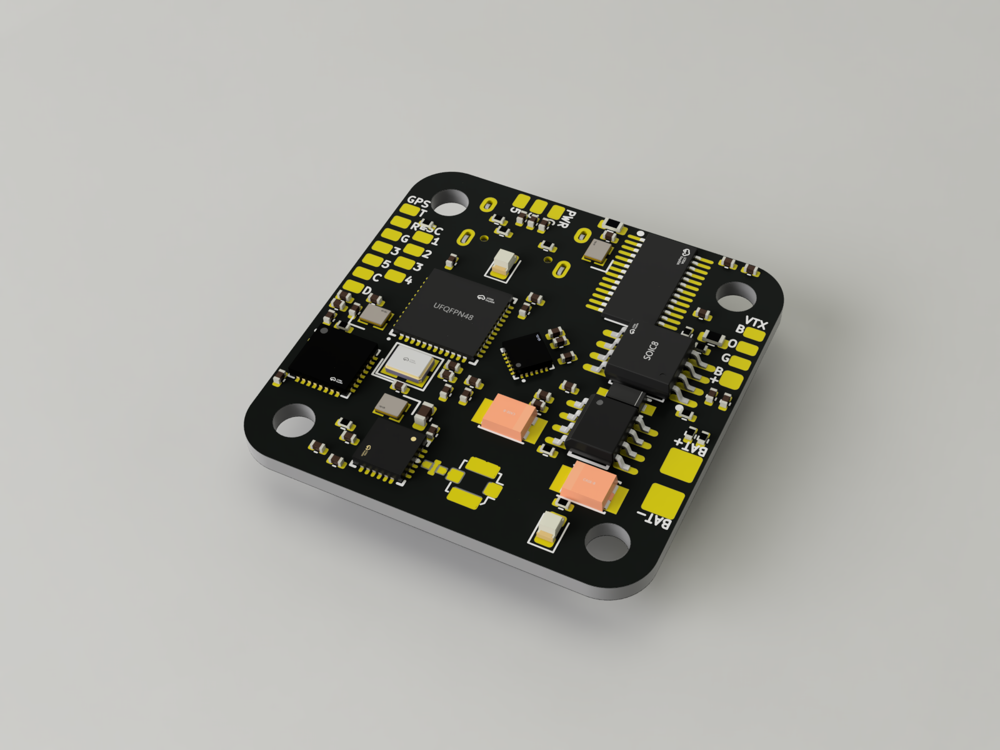
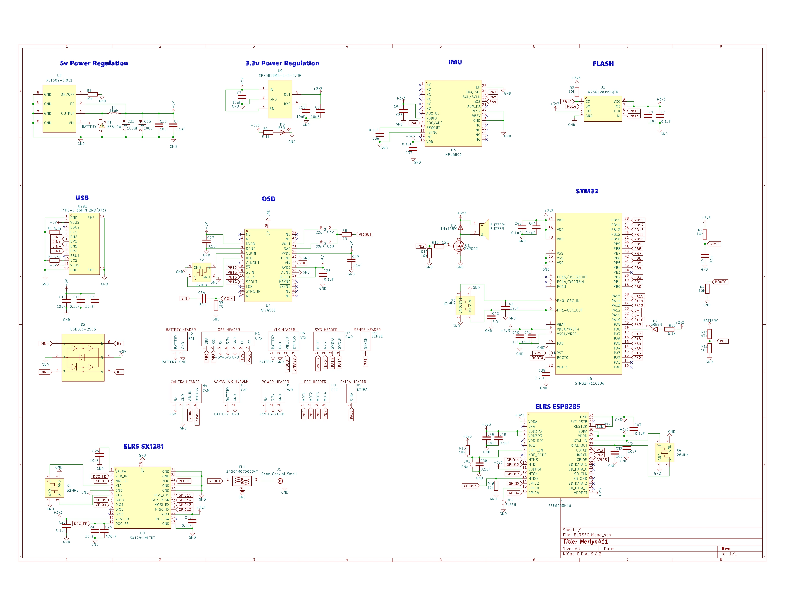
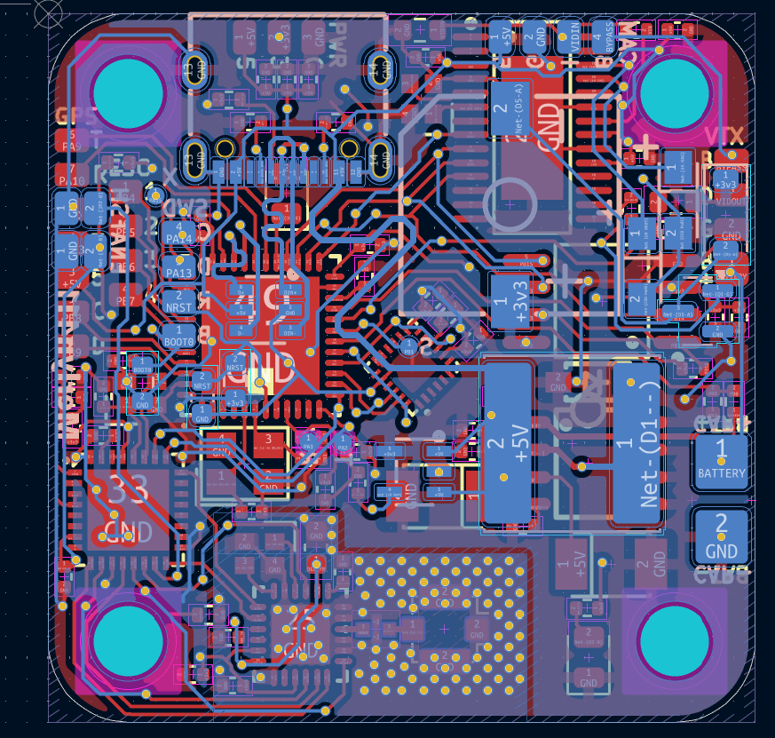
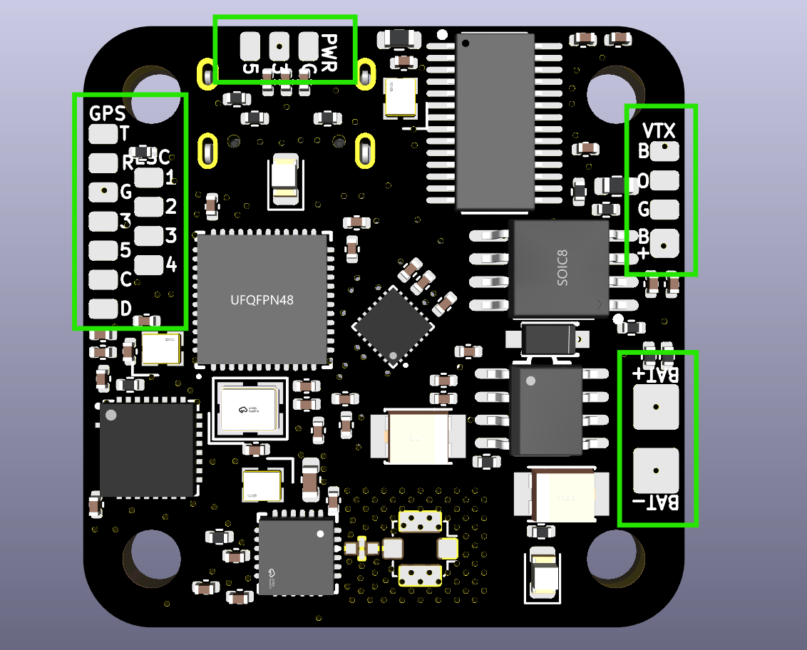
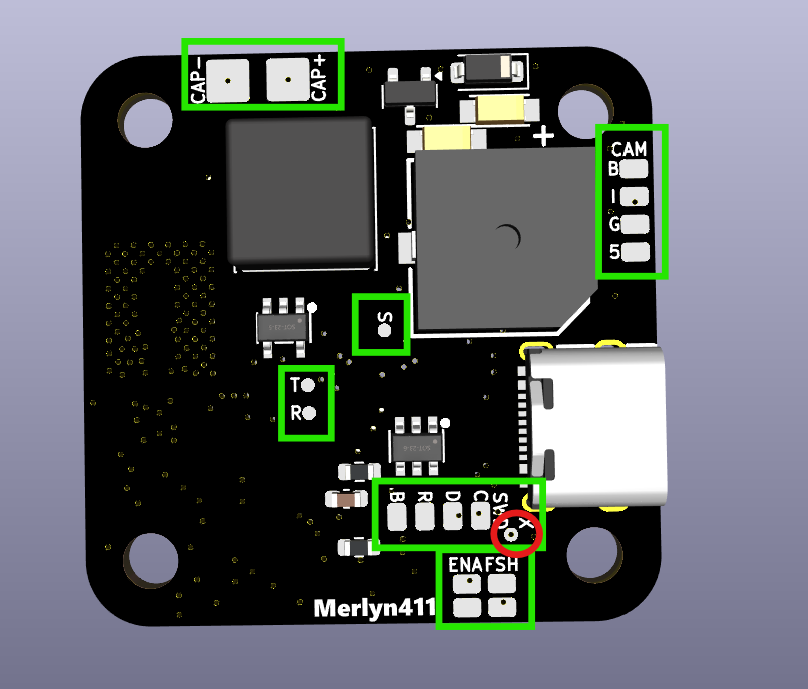
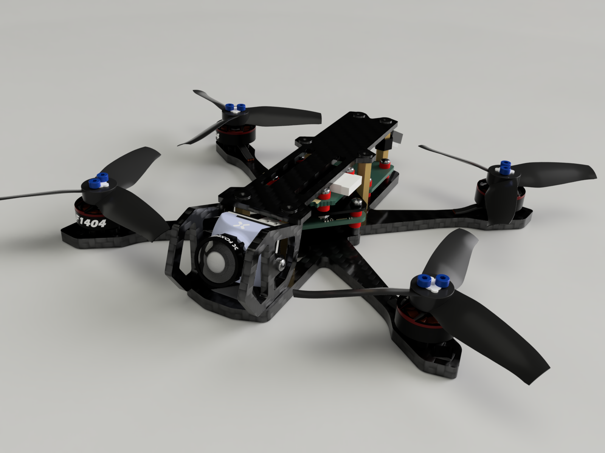
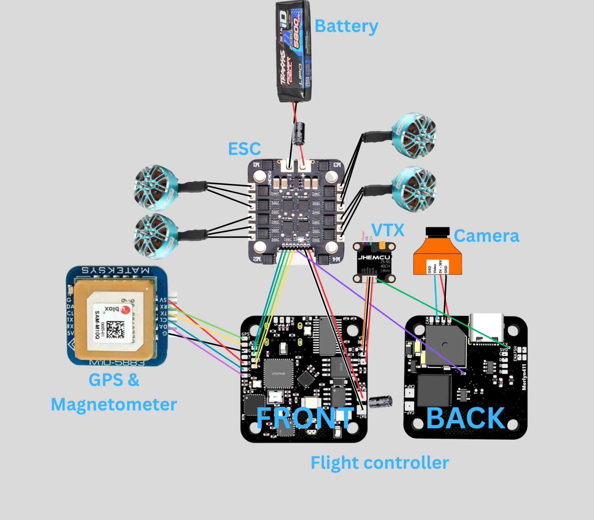
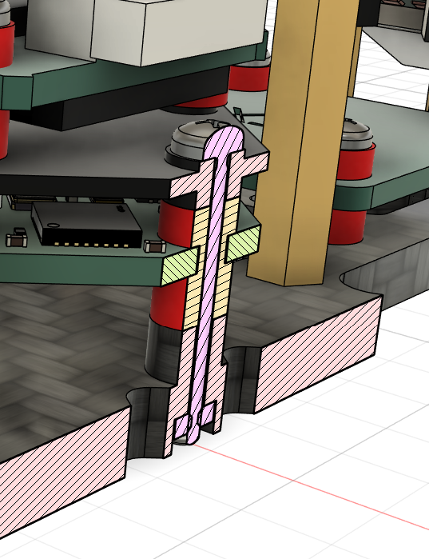
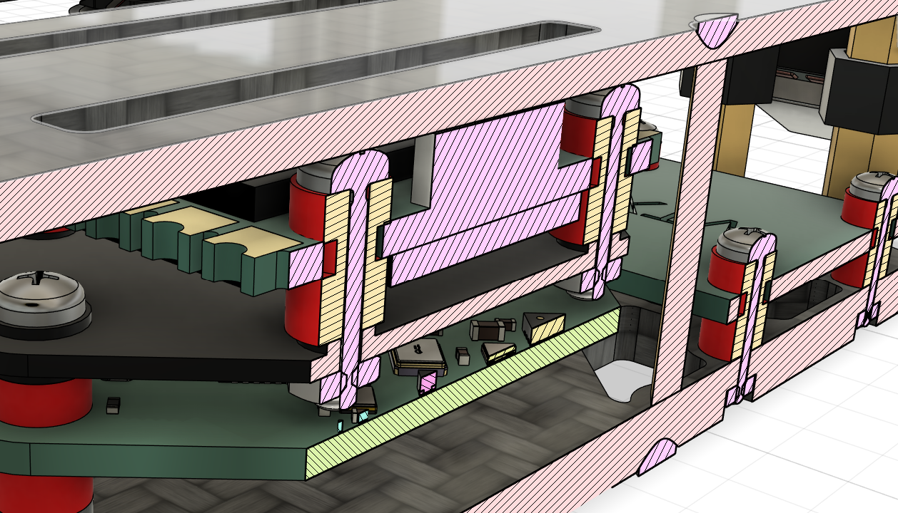

# MerylnF411 Flight Controller

## Introduction

This is my custom AIO (No ESC) flight controller! I started this project because commercial flight controllers get very expensive very quickly as you demand for more features like integrated radio receivers. I took on the challenge of designing my own betaflight compatible flight controller and it was difficult especially since the board has only 2 layers to save as much cost as possible and it's also my first time working with RF in circuits.

This flight controller is designed for a wide range of drones from 2" to as big as you want it to, and supports battery voltage from 2s to 8s although it is recommended to use a maximum of 6s. The 25.5mm pattern should be compatible with almost all frames on the market

It also features many quality of life features like an integrated ExpressLRS (ELRS) 2.4GHz receiver, an onboard OSD which inserts telemetry directly into the FPV video feed, 16MB flash memory for flight & blackbox logging and a buzzer for identifying error codes and to locate the drone.

While the primary focus of this projet is the flight controller hardware and firmware, I have also included a guide for the full 3 inch long range / freestyle drone build that this board was designed for

-----

## Hardware Specifications

  - **MCU:** STM32F411CEU6 (100MHz, 512KB Flash)
  - **IMU:** MPU6500 (SPI)
  - **OSD:** AT7456E (SPI)
  - **Blackbox:** Winbond W25Q128 16MB Flash (SPI)
  - **Receiver:** Integrated 2.4GHz ExpressLRS (ESP8285 & SX1281)
  - **Power Supply:** 5v and 3.3v rails up to 1A (3.3v rail is limited to 250mA)
  - **Mounting:** 25.5mm x 25.5mm square mounting pattern with M3 holes
  - **Peripherals** Includes pads for using external receivers, GPS, Magnetometer, analog camera and VTX

-----

## Pinout
### External Headers

| Header | Pin Name | STM32 Pin | Description |
| :--- | :--- | :--- | :--- |
| **GPS** | `T` | PA9 | UART1 TX (Connect to GPS RX) |
| | `R` | PA10 | UART1 RX (Connect to GPS TX) |
| | `3` | - | 3.3V Power Out |
| | `5` | - | 5V Power out |
| | `G` | - | Ground |
| | `C` | PB8 | I2C1 SCL (For Magnetometer) |
| | `D` | PB9 | I2C1 SDA (For Magnetometer) |
| **VTX** | `B`| - | Video Bypass (Direct from camera) |
| | `O` | - | Analog Video Out (From AT7456E) |
| | `G` | - | Ground |
| | `B+` | - | Battery Output |
| **CAM** | `B` | - | Video Bypass (Direct to VTX) |
| | `I` | - | Analog Video Input (From camera) |
| | `G` | - | Ground |
| | `5` | - | 5V Power Out |
| **SWD** | `C` | PA14 | SWCLK (Debug & Flash) |
| | `D` | PA13 | SWDIO (Debug & Flash) |
| | `R` | NRST | NRST (Debug & Flash) |
| | `B` | BOOT0 | BOOT0 (Debug & Flash) |
| **ESC** | `1-4` | PB4-PB7 | Motor Signal Outputs |
| **BAT** | `BAT+` | - | Battery Positive Input |
| | `BAT-` | - | Battery Negative Input |
| **CAP** | `CAP+` | - | Capacitor Anode |
| | `CAP-` | - | Capacitor Cathode |
| **PWR** | `G` | - | Ground |
| | `3` | - | 3.3V Power Out |
| | `5` | - | 5V Power Out |
| **Test Points** | `X` | PA15 | SmartAudio (Softserial 1 TX) |
| | `S` | PA15 | Current Sense Pin (From ESC) |
| | `T` | PA2 | ESP8285 RX Pin (STM32 TX PIN) |
| | `R` | PA3 | ESP8285 TX Pin (STM32 RX PIN) |

### Test Points & Pads

  - **External RX:**. Use these if you disable the internal ELRS receiver to connect other modules. Pad is labelled T and R on silkscreen.
  - **IRC Tramp and SmartAudio:** Connect VTX IRC or SmartAudio pin to the pad labeled with X on the silkscreen
  - **Current Sense:** Connect to ESC current sense pin. Pad is labelled S on silkscreen
  - **ENA & FSH:** Bridge ENA jumper to disable internal ELRS receiver. Bridge FSH jumper to put internal ELRS to flashing mode.
  - **Boot Mode (STM32):** To enter DFU mode for the flight controller, short the SWD B pad to any +3.3v rail while plugging in the USB.

-----

## Flight Controller Firmware (Betaflight)

Because this is a custom hardware layout, I believe that there is no standard targets that has the exact pin mapping as my flight controller. You must compile the firmware with the custom target definition in [/firmware/MERLYN411](https://github.com/YeetTheAnson/Merlyn411-FlightController/tree/main/firmware/MERLYN411) or use the pre compiled firmware in [/firmware/COMPILED](https://github.com/YeetTheAnson/Merlyn411-FlightController/tree/main/firmware/COMPILED).

> [!TIP]
> You can use flash another target to the flight controller and use betaflight CLI to remap the pin resource, however this is not recommended as the chosen target might not be compiled with a feature that this flight controller supports.

### How to build the firmware

1. Clone the [betaflight repository](https://github.com/betaflight/betaflight) using any UNIX terminal (use MYSYS2 MINGW64 on windows) and enter the directory
2. Enter `make configs` (install any required GCC toolchain if required)
3. Create a directory in betaflight/src/config/configs named `MERLYN411` and paste [config.h](https://github.com/YeetTheAnson/Merlyn411-FlightController/tree/main/firmware/MERLYN411/config.h) in the new directory
4. Enter `make MERLYN411` and the `.hex` file should appear in `betaflight/obj`

### Flashing the Flight Controller

1. **Via USB (DFU Mode):** Short the SWD `B` pad to 3.3v on the FC and plug in the USB C cable. Open Betaflight Configurator, select your compiled local `.hex` file, and click Flash Firmware.
2. **Via SWD:** If the bootloader is corrupted, connect an ST Link programmer to the `D`, `C`, and `D` (`R` is optional) pads and flash via STM32CubeProgrammer.

-----

## ExpressLRS Flashing

The internal ESP8285 and SX1281 receiver is wired to the STM32 via a hardware UART. It uses the standard **BETAFPV 2.4GHz Lite RX** firmware target. You can obtain the firmware binaries from the ELRS [site](https://expresslrs.github.io/web-flasher/) or from this repository in [/firmware/COMPILED](https://github.com/YeetTheAnson/Merlyn411-FlightController/tree/main/firmware/COMPILED). There's two way to flash the receiver:

### Method 1: Betaflight Passthrough

Note that betaflight must be installed and configured before passthrough works
1. Connect the FC via USB
2. Open the ExpressLRS Configurator [web flasher](https://expresslrs.github.io/web-flasher/) or app
3. Select `Receiver`
4. Select the `BETAFPV 2.4GHz Lite RX` target and press next
5. [OPTIONAL] Enter your bind phrase
6. Select the Betaflight Passthrough flashing method, press next and follow the steps

### Method 2: Manual Flashing

If the ESP8285 is bricked or passthrough fails, you can flash it directly using an FTDI adapter or another ESP8285/ESP8286/ESP32 or even an arduino

**Wiring the FTDI:**
The UART pads on the board are named relative to the STM32's perspective. Because the STM32's `TX` is connected to the ESP8285's `RX`, you must wire your FTDI adapter **RX to RX** and **TX to TX**.

  * FTDI `TX` -\> FC Pad `T`
  * FTDI `RX` -\> FC Pad `R`
  * FTDI `GND` -\> FC Pad `G`
  * FTDI `5V` -\> FC Pad `5` (or power via USB)

You must disable the STM32 when flashing via the T and R pad
using an external FTDI as it will intefere with the UART lines. You can disable the STM32 by shorting the SWD `R` pad to ground. Remember to short the `ENA` pads on the bottom side to put the ESP8285 into flashing mode.

-----

## Drone Assembly

While this project is mainly focused on the Merlyn411 flight controller, I designed it along with a high efficiency 3 inch cruiser drone in mind. If you want to recreate the full build, below is the component breakdown and assembly steps

### Component List
- **Flight Controller:** Merlyn411
- **ESC:** JHEMCU EM40A
- **Motors:** Sparkhobby 1303.5 5500KV
- **Propellers:** Gemfan 3016 Tri-Blade
- **VTX:** JHEMCU 600mW VTX
- **Camera:** Analog FPV micro(19mm) camera
- **Frame:** Custom frame
- **Battery:** 2S-4S LiPo or 2S/3S 18650 Li Ion packs

### Why 3D Printing the Frame is Not Recommended
Currently, I am using a custom frame that I 3D printed for prototyping. I strongly advise against using a 3D printed frame for your final build. The Merlyn411 uses the MPU6500 IMU, which is sensitive to mechanical noise and vibrations. 3D printed frames will flex and resonate significantly more than carbon fiber frames. This flexing will send noise into the gyro and resulting in terrible flight performance. Also the 3D printed frame will likely not survive a moderate impact.

### Fasteners
Because this is a custom stack with a 25.5mm FC and a 20mm ESC, the stack up is very specific. You will need:
* 6x M3 20mm Female to Female Brass Standoffs (Frame separation)
* 12x M3 6mm Screws (Frame to standoffs)
* 4x M2 Nuts (Stack base)
* 4x M2 16mm Screws (Main stack skewers)
* 8x M2 10mm Screws (Top stack/VTX skewers)
* 16x M2 6mm Screws (Motors)
* 4x M2 6mm Screws (Camera/Props)

### FC Stack
The Merlyn411 uses a 25.5x25.5mm mounting pattern (which is meant for AIO boards). However, I needed a standalone ESC which comes in standard sizes like 20x20mm.

To make these fit together, you must use a 3D printed adapter plate in [/production/3dPrint/boardAdapter.stl](https://github.com/YeetTheAnson/Merlyn411-FlightController/blob/main/production/3dPrint/boardAdapter.stl). 

**Stack Assembly Layer 1:**
1.  Place 4x M2 Nuts into the designated recesses in the bottom frame plate.
2. Push rubber grommets into the flight controller
3. Push 4x M2 16mm screws through the adapter plate, through the rubber grommet, and through the bottom plate into the M2 nuts

**Stack Assembly Layer 2:**
1. Push rubber grommets into the ESC
2. Push 4x M2 10mm screws through rubber grommets and through the adapter plate until it reaches another set of M2 nuts

### Mounting the VTX
The JHEMCU 600mW VTX mounts to the rear of the frame.
1.  Place 4x M2 Nuts into the bottom frame plate at in the rear
2. Push rubber grommets into the VTX
3.  Thread 4x M2 10mm screws through rubber grommets, down through the bottom plate, and into the nuts

### Final Assembly
1.  **Motors:** Mount the four 1303.5 5500KV motors to the arms using 16x M2 6mm screws (4 per motor). Ensure the screws do not touch the motor windings inside the bell.
2.  **Propellers:** Mount the Gemfan 3016 propeller. Pay attention to motor rotation directions (depending on your betaflight configuration, it could either be prop in or prop out). Fasten each prop with 2x M2 6mm screws.
3.  **Camera:** Mount the analog FPV camera to the front using 2x M2 6mm screws.
4.  **Closing the Frame:** Use the 6x M3 20mm standoffs and 12x M3 6mm screws to secure the top plate to the bottom plate